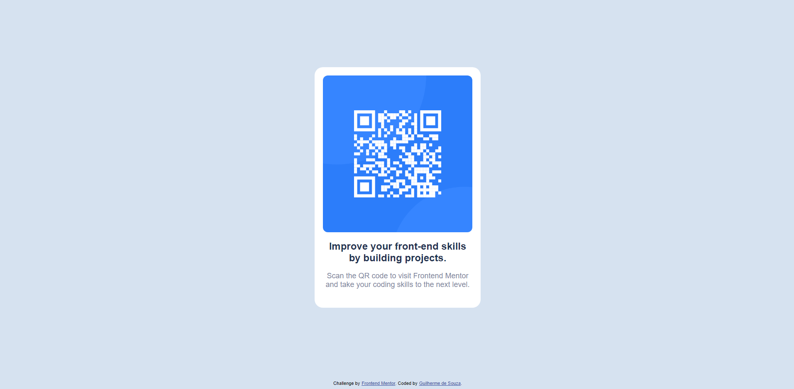

# Frontend Mentor - QR code component solution

This is a solution to the [QR code component challenge on Frontend Mentor](https://www.frontendmentor.io/challenges/qr-code-component-iux_sIO_H). Frontend Mentor challenges help you improve your coding skills by building realistic projects. 


## Overview

### How to run

Go to the project main folder and run

```
parcel index.html
```

### Screenshot




## My process

### Built with

- Semantic HTML5 markup
- SASS
- Flexbox
- Parcel


## Author

- Github - [Hguigit](https://github.com/HGuigit)
- Linkedin - [Guilherme de Souza](https://www.linkedin.com/in/guilherme-souza-hg/)

